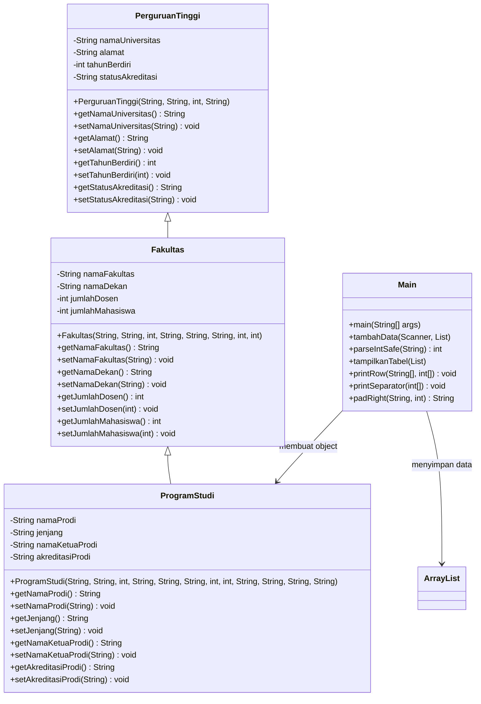

# TP2DPBO2526C2 — Sistem Data Perguruan Tinggi

Saya Luthfi Aulia Jodi dengan NIM 2521743 mengerjakan Tugas Praktikum 2 dalam mata kuliah Desain Pemrograman Berbasis Objek untuk keberkahan-Nya maka saya tidak melakukan kecurangan seperti yang dispesifikasikan. Aamiin.

## Deskripsi Program

Tugas Praktikum 2 (DPBO 2025/2026, kelas C2): program pengelolaan data perguruan tinggi yang dibuat menggunakan pendekatan Pemrograman Berorientasi Objek (OOP).

Program ini digunakan untuk menyimpan dan menampilkan informasi mengenai perguruan tinggi, fakultas, dan program studi. Data tersebut disusun menggunakan konsep **multilevel inheritance**, sehingga setiap tingkatan memiliki atribut dan informasi masing-masing.

Desain OOP yang sama diimplementasikan ulang dalam **empat bahasa pemrograman** sebagai eksplorasi konsep: **Java** (implementasi acuan/utama), **C++**, **PHP** (dilengkapi tampilan web dan fitur tambahan upload gambar/logo perguruan tinggi), dan **Python**. Keempatnya memiliki struktur class dan alur logika yang pada dasarnya identik.

Program memiliki tiga class utama dalam struktur inheritance (berlaku di seluruh bahasa):

* `PerguruanTinggi` sebagai class induk tingkat pertama yang menyimpan informasi umum perguruan tinggi.
* `Fakultas` sebagai class turunan dari `PerguruanTinggi` yang menambahkan informasi fakultas.
* `ProgramStudi` sebagai class turunan dari `Fakultas` yang menambahkan informasi program studi.

Program utama pada masing-masing bahasa (`Main.java`, `main.cpp`, `index.php`, `main.py`) digunakan untuk menerima input, menyimpan object ke dalam sebuah koleksi/list, menampilkan menu, dan menampilkan data dalam bentuk tabel.

## Daftar Isi

1. [Struktur Folder](#1-struktur-folder)
2. [Desain Program](#2-desain-program)
3. [Konsep OOP yang Digunakan](#3-konsep-oop-yang-digunakan)
4. [Alur Kode](#4-alur-kode)
5. [Cara Menjalankan](#5-cara-menjalankan)
6. [Dokumentasi Program](#6-dokumentasi-program)
7. [Catatan dan Batasan](#7-catatan-dan-batasan)

## 1. Struktur Folder

```text
TP2DPBO2526C2/
├── c++/
│   ├── Fakultas.h
│   ├── main.cpp
│   ├── PerguruanTinggi.h
│   └── ProgramStudi.h
│
├── DOKUMENTASI/
│   ├── c++/
│   │   ├── Menu utama.png
│   │   ├── Nambah data.png
│   │   └── Tampilkan Data.png
│   ├── Java/
│   │   ├── Menu utama.png
│   │   ├── Nambah data.png
│   │   └── Tampilkan Data.png
│   ├── php/
│   │   └── php.png
│   └── Python/
│       ├── Menu utama.png
│       ├── Nambah data.png
│       └── Tampilkan Data.png
│
├── java/
│   ├── Fakultas.java
│   ├── Fakultas.class
│   ├── Main.java
│   ├── Main.class
│   ├── PerguruanTinggi.java
│   ├── PerguruanTinggi.class
│   ├── ProgramStudi.java
│   ├── ProgramStudi.class
│   ├── tempCodeRunnerFile.java
│   ├── Akademi
│   ├── IPDN
│   ├── ITB
│   ├── Politeknik
│   └── UPI
│
├── php/
│   ├── uploads/
│   ├── Fakultas.php
│   ├── index.php
│   ├── PerguruanTinggi.php
│   └── ProgramStudi.php
│
└── python/
    ├── fakultas.py
    ├── main.py
    ├── perguruan_tinggi.py
    └── program_studi.py
```

Keterangan singkat tiap bagian:

| Folder / File | Isi |
|---|---|
| `c++/` | Implementasi program dalam bahasa C++. Class ditulis sebagai header file (`PerguruanTinggi.h`, `Fakultas.h`, `ProgramStudi.h`), program utama ada di `main.cpp`. |
| `DOKUMENTASI/` | Screenshot hasil menjalankan program, dikelompokkan per bahasa: `c++/`, `Java/`, `php/`, `Python/`. Masing-masing berisi tangkapan layar menu utama, proses tambah data, dan tampilan data. |
| `java/` | Implementasi program dalam bahasa Java (implementasi acuan/utama tugas ini), lengkap dengan hasil compile (`.class`). Folder/berkas seperti `ITB`, `UPI`, `IPDN`, `Politeknik`, `Akademi` merupakan sisa berkas uji coba program, bukan bagian dari desain class. |
| `php/` | Implementasi program dalam bahasa PHP berbentuk aplikasi web sederhana (form input + tabel data), dilengkapi fitur tambahan upload gambar/logo perguruan tinggi yang disimpan di folder `uploads/`. |
| `python/` | Implementasi program dalam bahasa Python, mengikuti struktur class dan alur yang sama dengan versi Java/C++. |

## 2. Desain Program

> Penjelasan pada bagian 2–4 menggunakan sintaks Java sebagai acuan, karena struktur class dan alur logikanya sama persis pada seluruh implementasi (C++, PHP, Python) — hanya berbeda sintaks bahasa masing-masing. Versi PHP memiliki satu atribut tambahan (`gambar`/logo) yang tidak ada pada ketiga versi lainnya; lihat catatan di bagian 7.

Program menggunakan konsep multilevel inheritance dengan tiga tingkatan class.

Struktur inheritance:

```text
PerguruanTinggi
       ↓
    Fakultas
       ↓
  ProgramStudi
```

Artinya:

* `Fakultas` mewarisi atribut dan method dari `PerguruanTinggi`.
* `ProgramStudi` mewarisi atribut dan method dari `Fakultas`.
* Karena `Fakultas` merupakan turunan `PerguruanTinggi`, maka `ProgramStudi` juga secara tidak langsung mendapatkan atribut dan method dari `PerguruanTinggi`.

### 2.1 Class `PerguruanTinggi`

`PerguruanTinggi` merupakan class induk pertama. Class ini menyimpan informasi umum mengenai sebuah perguruan tinggi.

**Atribut**

| Atribut | Tipe | Keterangan |
|---|---|---|
| `namaUniversitas` | `String` | Nama perguruan tinggi |
| `alamat` | `String` | Alamat perguruan tinggi |
| `tahunBerdiri` | `int` | Tahun berdirinya perguruan tinggi |
| `statusAkreditasi` | `String` | Status akreditasi perguruan tinggi |

**Method**

| Method | Fungsi |
|---|---|
| `PerguruanTinggi(...)` | Constructor untuk mengisi data perguruan tinggi |
| `getNamaUniversitas()` | Mengambil nama universitas |
| `setNamaUniversitas()` | Mengubah nama universitas |
| `getAlamat()` | Mengambil alamat |
| `setAlamat()` | Mengubah alamat |
| `getTahunBerdiri()` | Mengambil tahun berdiri |
| `setTahunBerdiri()` | Mengubah tahun berdiri |
| `getStatusAkreditasi()` | Mengambil status akreditasi |
| `setStatusAkreditasi()` | Mengubah status akreditasi |

### 2.2 Class `Fakultas`

`Fakultas` merupakan class turunan dari `PerguruanTinggi`.

Deklarasinya:

```java
public class Fakultas extends PerguruanTinggi
```

Karena menggunakan `extends`, class `Fakultas` dapat menggunakan atribut dan method yang diwariskan dari `PerguruanTinggi`. Selain itu, `Fakultas` memiliki atribut tambahan.

**Atribut Tambahan**

| Atribut | Tipe | Keterangan |
|---|---|---|
| `namaFakultas` | `String` | Nama fakultas |
| `namaDekan` | `String` | Nama dekan fakultas |
| `jumlahDosen` | `int` | Jumlah dosen pada fakultas |
| `jumlahMahasiswa` | `int` | Jumlah mahasiswa pada fakultas |

**Method**

| Method | Fungsi |
|---|---|
| `Fakultas(...)` | Constructor untuk mengisi data perguruan tinggi dan fakultas |
| `getNamaFakultas()` | Mengambil nama fakultas |
| `setNamaFakultas()` | Mengubah nama fakultas |
| `getNamaDekan()` | Mengambil nama dekan |
| `setNamaDekan()` | Mengubah nama dekan |
| `getJumlahDosen()` | Mengambil jumlah dosen |
| `setJumlahDosen()` | Mengubah jumlah dosen |
| `getJumlahMahasiswa()` | Mengambil jumlah mahasiswa |
| `setJumlahMahasiswa()` | Mengubah jumlah mahasiswa |

Constructor `Fakultas` menggunakan:

```java
super(namaUniversitas, alamat, tahunBerdiri, statusAkreditasi);
```

`super()` digunakan untuk memanggil constructor dari class induk `PerguruanTinggi`.

### 2.3 Class `ProgramStudi`

`ProgramStudi` merupakan class turunan dari `Fakultas`.

Deklarasinya:

```java
public class ProgramStudi extends Fakultas
```

Class ini merupakan level ketiga dalam inheritance dan memiliki atribut khusus untuk program studi.

**Atribut Tambahan**

| Atribut | Tipe | Keterangan |
|---|---|---|
| `namaProdi` | `String` | Nama program studi |
| `jenjang` | `String` | Jenjang pendidikan program studi |
| `namaKetuaProdi` | `String` | Nama ketua program studi |
| `akreditasiProdi` | `String` | Akreditasi program studi |

**Method**

| Method | Fungsi |
|---|---|
| `ProgramStudi(...)` | Constructor untuk mengisi seluruh data sampai level program studi |
| `getNamaProdi()` | Mengambil nama program studi |
| `setNamaProdi()` | Mengubah nama program studi |
| `getJenjang()` | Mengambil jenjang program studi |
| `setJenjang()` | Mengubah jenjang program studi |
| `getNamaKetuaProdi()` | Mengambil nama ketua program studi |
| `setNamaKetuaProdi()` | Mengubah nama ketua program studi |
| `getAkreditasiProdi()` | Mengambil akreditasi program studi |
| `setAkreditasiProdi()` | Mengubah akreditasi program studi |

Constructor `ProgramStudi` memanggil constructor `Fakultas` menggunakan:

```java
super(
    namaUniversitas, alamat, tahunBerdiri, statusAkreditasi,
    namaFakultas, namaDekan, jumlahDosen, jumlahMahasiswa
);
```

Dengan begitu, data dari tiga level dapat dibuat dalam satu object `ProgramStudi`.

## 3. Konsep OOP yang Digunakan

### 3.1 Class dan Object

Program memiliki beberapa class:

```text
PerguruanTinggi
Fakultas
ProgramStudi
Main
```

Object yang digunakan untuk menyimpan data dibuat dari class `ProgramStudi`. Contohnya:

```java
dataList.add(new ProgramStudi(
    "Institut Teknologi Bandung (ITB)",
    "Jl. Ganesa No. 10, Bandung, Jawa Barat",
    1959,
    "Unggul",
    "Sekolah Teknik Elektro dan Informatika (STEI)",
    "(Contoh) Dr. Ir. Bagus Prasetyo, M.T.",
    120,
    2500,
    "Teknik Informatika",
    "S1",
    "(Contoh) Dr. Hana Yuliana, S.T., M.T.",
    "Unggul"
));
```

Object tersebut menyimpan informasi dari:

```text
PerguruanTinggi
        +
     Fakultas
        +
   ProgramStudi
```

### 3.2 Encapsulation

Setiap atribut dibuat menggunakan access modifier `private`. Contohnya:

```java
private String namaUniversitas;
private String alamat;
private int tahunBerdiri;
private String statusAkreditasi;
```

Atribut tidak diakses secara langsung dari luar class. Untuk mengambil atau mengubah nilainya digunakan getter dan setter. Contoh:

```java
p.getNamaUniversitas();
p.setNamaUniversitas("Nama Baru");
```

Dengan demikian data pada class tetap terenkapsulasi.

### 3.3 Multilevel Inheritance

Konsep utama pada program ini adalah multilevel inheritance. Hubungannya:

```text
PerguruanTinggi
      │
      │ extends
      ↓
   Fakultas
      │
      │ extends
      ↓
 ProgramStudi
```

Contohnya:

```java
public class Fakultas extends PerguruanTinggi
```

dan:

```java
public class ProgramStudi extends Fakultas
```

Dengan struktur tersebut, `ProgramStudi` dapat menggunakan method dari `Fakultas` dan `PerguruanTinggi`. Contohnya:

```java
p.getNamaUniversitas();
p.getNamaFakultas();
p.getNamaProdi();
```

Ketiga method tersebut berasal dari level class yang berbeda tetapi dapat digunakan oleh object `ProgramStudi`.

### 3.4 Constructor dan `super()`

Constructor digunakan untuk mengisi nilai awal object. Pada class `Fakultas`, digunakan:

```java
super(
    namaUniversitas,
    alamat,
    tahunBerdiri,
    statusAkreditasi
);
```

Sedangkan pada class `ProgramStudi`, digunakan:

```java
super(
    namaUniversitas,
    alamat,
    tahunBerdiri,
    statusAkreditasi,
    namaFakultas,
    namaDekan,
    jumlahDosen,
    jumlahMahasiswa
);
```

Alurnya menjadi:

```text
ProgramStudi constructor
        ↓
Fakultas constructor
        ↓
PerguruanTinggi constructor
```

Setelah data dari class induk selesai diisi, constructor kembali ke class turunan untuk mengisi atribut miliknya sendiri.

### 3.5 Getter dan Setter

Setiap atribut memiliki getter dan setter. Contohnya pada `ProgramStudi`:

```java
public String getNamaProdi() {
    return namaProdi;
}
```

dan:

```java
public void setNamaProdi(String namaProdi) {
    this.namaProdi = namaProdi;
}
```

Getter digunakan untuk mengambil data, sedangkan setter digunakan untuk mengubah data.

### 3.6 ArrayList of Object

Data program studi disimpan menggunakan:

```java
List<ProgramStudi> dataList = new ArrayList<>();
```

Artinya program menggunakan `ArrayList` untuk menyimpan kumpulan object `ProgramStudi`. Data baru ditambahkan menggunakan:

```java
dataList.add(baru);
```

Data kemudian dapat diakses menggunakan:

```java
dataList.get(i);
```

Penggunaan `ArrayList` membuat jumlah data lebih fleksibel dibandingkan array dengan ukuran tetap.

### 3.7 Class Diagram



### 3.8 Pembagian Tanggung Jawab

| Bagian | File | Tugas |
|---|---|---|
| Class Induk | `PerguruanTinggi.java` | Menyimpan informasi umum perguruan tinggi |
| Class Turunan | `Fakultas.java` | Menambahkan informasi fakultas |
| Class Turunan | `ProgramStudi.java` | Menambahkan informasi program studi |
| Program Utama | `Main.java` | Menu, input, penyimpanan, dan penampilan data |
| Penyimpanan | `ArrayList<ProgramStudi>` | Menyimpan kumpulan object program studi |

### 3.9 Struktur Data yang Disimpan

Setiap object `ProgramStudi` memiliki seluruh informasi dari tiga tingkatan. Contohnya:

```text
ProgramStudi
│
├── Data Perguruan Tinggi
│   ├── Nama Universitas
│   ├── Alamat
│   ├── Tahun Berdiri
│   └── Akreditasi Universitas
│
├── Data Fakultas
│   ├── Nama Fakultas
│   ├── Nama Dekan
│   ├── Jumlah Dosen
│   └── Jumlah Mahasiswa
│
└── Data Program Studi
    ├── Nama Program Studi
    ├── Jenjang
    ├── Nama Ketua Prodi
    └── Akreditasi Prodi
```

Total terdapat 12 atribut yang dapat disimpan dalam satu object `ProgramStudi` (13 pada versi PHP, karena ada tambahan atribut `gambar`).

## 4. Alur Kode

### 4.1 Alur Utama Program

Program dimulai dengan membuat `Scanner` dan `ArrayList`.

```java
Scanner sc = new Scanner(System.in);
List<ProgramStudi> dataList = new ArrayList<>();
```

Kemudian program memasukkan 5 data awal. Setelah data awal selesai dibuat, program masuk ke menu utama. Alurnya:

```text
Mulai
  ↓
Membuat Scanner
  ↓
Membuat ArrayList
  ↓
Memasukkan 5 data awal
  ↓
Menampilkan menu
  ↓
User memilih menu
  ↓
┌──────────────────────────┐
│ 1. Tambah Data            │
│ 2. Tampilkan Seluruh Data │
│ 3. Keluar                 │
└──────────────────────────┘
  ↓
Menjalankan pilihan
  ↓
Kembali ke menu
  ↓
Pilihan 3?
 ├── Tidak → kembali ke menu
 └── Ya → Program selesai
```

### 4.2 Data Awal

Program memiliki 5 data awal yang langsung dimasukkan ke dalam `ArrayList` (versi konsol) atau session/list (versi PHP).

| No | Perguruan Tinggi | Fakultas | Program Studi | Jenjang |
|---|---|---|---|---|
| 1 | Institut Teknologi Bandung (ITB) | STEI | Teknik Informatika | S1 |
| 2 | Universitas Pendidikan Indonesia (UPI) | FPMIPA | Pendidikan Matematika | S1 |
| 3 | Institut Pemerintahan Dalam Negeri (IPDN) | Fakultas Politik Pemerintahan | Kebijakan Publik | S1 Terapan |
| 4 | Akademi Militer (Akmil) | Direktorat Pendidikan Pertahanan | Manajemen Pertahanan | D4 |
| 5 | Politeknik Statistika STIS | Jurusan Statistika Sosial Kependudukan | Statistika | D4 |

Data tersebut dibuat menggunakan object `ProgramStudi`. Contohnya:

```java
dataList.add(new ProgramStudi(...));
```

### 4.3 Menu Tambah Data

Menu `1` digunakan untuk menambahkan data baru. Program meminta input secara berurutan:

```text
Nama Universitas
Alamat
Tahun Berdiri
Status Akreditasi
Nama Fakultas
Nama Dekan
Jumlah Dosen
Jumlah Mahasiswa
Nama Program Studi
Jenjang
Nama Ketua Prodi
Akreditasi Prodi
```

Alurnya:

```text
Pilih menu 1
   ↓
Input data perguruan tinggi
   ↓
Input data fakultas
   ↓
Input data program studi
   ↓
Membuat object ProgramStudi
   ↓
Menambahkan object ke ArrayList
   ↓
Data berhasil ditambahkan
```

Object dibuat menggunakan:

```java
ProgramStudi baru = new ProgramStudi(
    namaUniversitas,
    alamat,
    tahunBerdiri,
    statusAkreditasi,
    namaFakultas,
    namaDekan,
    jumlahDosen,
    jumlahMahasiswa,
    namaProdi,
    jenjang,
    namaKetuaProdi,
    akreditasiProdi
);
```

Kemudian dimasukkan ke list:

```java
dataList.add(baru);
```

### 4.4 Input Angka

Untuk input tahun berdiri, jumlah dosen, dan jumlah mahasiswa digunakan method:

```java
parseIntSafe()
```

Method tersebut mencoba mengubah input String menjadi `int`.

```java
Integer.parseInt(s.trim());
```

Jika input bukan angka, program menangkap `NumberFormatException` dan mengembalikan nilai:

```text
0
```

Dengan demikian input angka yang tidak valid tidak langsung menghentikan program.

### 4.5 Menu Tampilkan Seluruh Data

Menu `2` digunakan untuk menampilkan seluruh data yang ada di `ArrayList`. Program pertama-tama mengecek:

```java
if (dataList.isEmpty())
```

Jika list kosong:

```text
Belum ada data.
```

Jika terdapat data, program membuat array dua dimensi:

```java
String[][] rows = new String[dataList.size()][kolom];
```

Array tersebut digunakan untuk menyiapkan isi tabel sebelum ditampilkan.

### 4.6 Pembuatan Tabel

Program menampilkan data dalam bentuk tabel menggunakan beberapa method:

```text
tampilkanTabel()
       ↓
   printRow()
       ↓
 printSeparator()
       ↓
   padRight()
```

**`tampilkanTabel()`** — Mengambil data dari setiap object `ProgramStudi` menggunakan getter. Contohnya:

```java
p.getNamaUniversitas();
p.getNamaFakultas();
p.getNamaProdi();
```

Kemudian data dimasukkan ke dalam `rows`.

**`printRow()`** — Digunakan untuk mencetak satu baris tabel.

**`printSeparator()`** — Digunakan untuk membuat garis pembatas tabel.

**`padRight()`** — Digunakan untuk memberikan spasi agar isi setiap kolom memiliki ukuran yang rapi.

### 4.7 Lebar Kolom Dinamis

Program tidak menggunakan ukuran kolom tabel yang tetap. Lebar setiap kolom dihitung berdasarkan panjang:

```text
Header
+
Isi data terpanjang
```

Contohnya jika nama universitas paling panjang adalah:

```text
Institut Pemerintahan Dalam Negeri (IPDN)
```

maka lebar kolom `Universitas` akan menyesuaikan panjang teks tersebut. Perhitungan dilakukan menggunakan:

```java
if (row[c] != null && row[c].length() > width[c]) {
    width[c] = row[c].length();
}
```

Dengan cara ini tabel tetap dapat menyesuaikan isi data.

### 4.8 Menu Keluar

Menu `3` digunakan untuk mengakhiri program. Ketika user memilih:

```text
3
```

maka:

```java
running = false;
```

Kemudian program menampilkan:

```text
Program selesai.
```

Setelah perulangan berhenti, `Scanner` ditutup menggunakan:

```java
sc.close();
```

## 5. Cara Menjalankan

### 5.1 Versi Java (`java/`)

Pastikan JDK sudah terpasang, lalu masuk ke folder `java/`:

```bash
cd java
javac Main.java PerguruanTinggi.java Fakultas.java ProgramStudi.java
java Main
```

Program akan menampilkan:

```text
===== Selamat Datang di Data Perguruan Tinggi =====
1. Tambah Data Perguruan Tinggi
2. Tampilkan Seluruh Data
3. Keluar
Pilih menu:
```

### 5.2 Versi C++ (`c++/`)

Pastikan compiler C++ (g++/MinGW) sudah terpasang, lalu masuk ke folder `c++/`:

```bash
cd c++
g++ main.cpp -o main
./main        # Linux/Mac
main.exe      # Windows
```

### 5.3 Versi PHP (`php/`)

Pastikan PHP sudah terpasang (atau gunakan XAMPP/Laragon), lalu masuk ke folder `php/` dan jalankan built-in server PHP:

```bash
cd php
php -S localhost:8000
```

Buka browser ke `http://localhost:8000/index.php`. Pastikan folder `uploads/` ada di dalam folder `php/` dan writable, karena digunakan untuk menyimpan gambar/logo perguruan tinggi yang diunggah lewat form.

### 5.4 Versi Python (`python/`)

Pastikan Python 3 sudah terpasang, lalu masuk ke folder `python/`:

```bash
cd python
python main.py
```

## 6. Dokumentasi Program

Dokumentasi berupa screenshot hasil menjalankan program tersedia di folder `DOKUMENTASI/`, dikelompokkan per bahasa pemrograman:

```text
DOKUMENTASI/
├── c++/     → Menu utama.png, Nambah data.png, Tampilkan Data.png
├── Java/    → Menu utama.png, Nambah data.png, Tampilkan Data.png
├── php/     → php.png
└── Python/  → Menu utama.png, Nambah data.png, Tampilkan Data.png
```

### 6.1 Menu Utama

Menu utama menyediakan tiga pilihan:

```text
1. Tambah Data Perguruan Tinggi
2. Tampilkan Seluruh Data
3. Keluar
```

Lihat: `DOKUMENTASI/<bahasa>/Menu utama.png`

### 6.2 Tambah Data

Pada menu ini user dapat memasukkan data lengkap dari tiga tingkatan:

```text
Perguruan Tinggi
       ↓
Fakultas
       ↓
Program Studi
```

Data yang dimasukkan kemudian dibuat menjadi satu object `ProgramStudi`.

Lihat: `DOKUMENTASI/<bahasa>/Nambah data.png`

### 6.3 Tampilkan Seluruh Data

Program menampilkan seluruh object `ProgramStudi` yang tersimpan. Informasi yang ditampilkan meliputi:

```text
No
Universitas
Alamat
Tahun
Akreditasi Univ
Fakultas
Dekan
Jml Dosen
Jml Mhs
Program Studi
Jenjang
Ketua Prodi
Akreditasi Prodi
```

Lihat: `DOKUMENTASI/<bahasa>/Tampilkan Data.png`

### 6.4 Data Bertambah

Setelah user menambahkan data baru, object tersebut dimasukkan ke dalam struktur penyimpanan (`ArrayList` pada Java/C++, `list` pada Python, atau `$_SESSION['dataList']` pada PHP). Saat menu tampilkan data dipilih kembali (atau halaman PHP dimuat ulang), data baru akan ikut ditampilkan pada tabel.

## 7. Catatan dan Batasan

### Penanganan Input

| Bagian | Yang Ditangani | Yang Belum Ditangani |
|---|---|---|
| Penyimpanan | Menggunakan `ArrayList`/list/session sehingga ukuran data fleksibel | Data belum disimpan ke database |
| Nama | Input menggunakan `String` | Belum ada validasi khusus untuk nama |
| Alamat | Dapat menerima input alamat lengkap | Belum ada validasi format alamat |
| Tahun Berdiri | Menggunakan `int` | Input angka yang salah akan menjadi `0` (versi Java) |
| Jumlah Dosen | Menggunakan `int` | Belum ada validasi agar nilainya tidak negatif |
| Jumlah Mahasiswa | Menggunakan `int` | Belum ada validasi agar nilainya tidak negatif |
| Akreditasi | Disimpan sebagai `String`, dipilih dari dropdown pada versi PHP | — |
| Jenjang | Disimpan sebagai `String` | Belum dibatasi pada pilihan jenjang tertentu di semua versi |
| Menu | Pilihan menu divalidasi melalui `switch` | Input selain `1`, `2`, dan `3` dianggap tidak valid |

### Hal Lain yang Perlu Diketahui

* Program menggunakan konsep multilevel inheritance dengan tiga level class, diimplementasikan konsisten pada keempat bahasa (Java, C++, PHP, Python).
* `PerguruanTinggi` merupakan class induk, `Fakultas` turunan dari `PerguruanTinggi`, dan `ProgramStudi` turunan dari `Fakultas`.
* Semua atribut dibuat `private` sebagai penerapan encapsulation, diakses melalui getter dan setter.
* Constructor menggunakan `super()` (Java/PHP) atau daftar inisialisasi konstruktor (C++) untuk meneruskan data ke class induk.
* Program memiliki 5 data awal pada setiap versi.
* Versi Java, C++, dan Python berjalan sebagai program konsol; data yang ditambahkan hanya tersimpan selama program berjalan (belum ada penyimpanan permanen/database).
* **Versi PHP** berjalan sebagai aplikasi web: data disimpan sementara di `$_SESSION` selama sesi browser aktif, dan memiliki fitur tambahan berupa **upload gambar/logo perguruan tinggi** (disimpan di folder `uploads/`) yang tidak ada pada ketiga versi lainnya.
* Program berfokus pada penerapan class, object, encapsulation, constructor, getter/setter, multilevel inheritance, `extends`/inheritance, `super()`, dan penyimpanan koleksi object (ArrayList/list).
* Program belum menggunakan inheritance lain seperti hierarchical atau multiple inheritance, dan belum menggunakan polymorphism secara khusus karena fokus tugas adalah penerapan multilevel inheritance.
